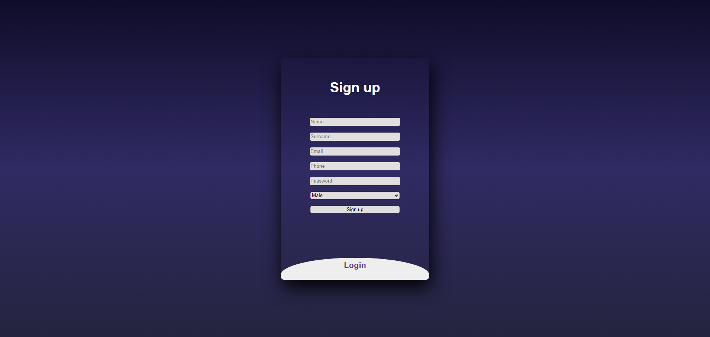
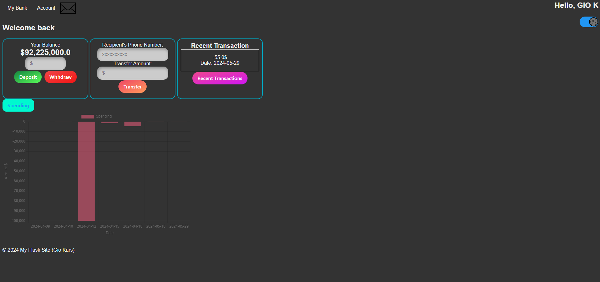
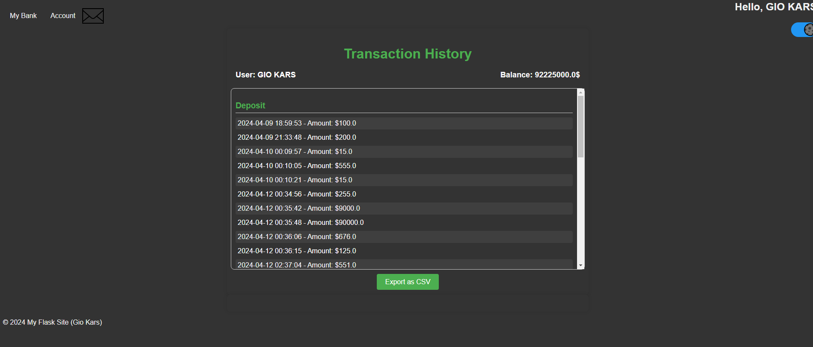

# Flask Banking System

A Flask-based web application designed to help customers manage their banking transactions and personal data. The system also allows an admin to monitor customer information and manage access to the platform, enabling customers to deposit or withdraw funds securely.

## Table of Contents

- [Overview](#overview)
- [Features](#features)
- [Installation](#installation)
- [Usage](#usage)
- [Screenshots](#screenshots)
- [Technologies](#technologies)
- [Contributing](#contributing)
- [License](#license)

## Overview

The Flask Banking System provides a secure platform for customers to manage their bank accounts, view transaction history, and perform financial operations such as deposits and withdrawals. Administrators have access to view customer information and control customer access to the platform, ensuring a safe and regulated banking environment.

## Features

- **Customer Self-Service**: Customers can manage their personal data, view transaction history, and conduct transactions.
- **Admin Controls**: Admins can view customer information and manage their access to the platform.
- **OTP Verification**: Secure sign-up process with One-Time Password (OTP) sent to the user's email for verification.
- **Money Transfer via Phone Number**: Users can send money to others if they know their phone number.
- **Download Transaction History**: Customers can download their transaction history as a file.

## Installation

### Prerequisites

- Python 3.x
- Flask
- pip (Python package installer)

### Setup

1. **Clone the repository**:

   ```bash
   git clone https://github.com/GioKars/Flask-Banking-System.git
   cd Flask-Banking-System
   ```

2. **Create and activate a virtual environment**:

   ```bash
   python -m venv .venv
   .venv\Scripts\activate   # On Windows
   source .venv/bin/activate  # On macOS/Linux
   ```

3. **Install the required packages**:

   ```bash
   pip install -r requirements.txt
   ```

4. **Set up environment variables**:

   - Create a `.env` file in the root directory of the project:
     ```plaintext
     FLASK_APP=app.py
     FLASK_ENV=development
     SECRET_KEY=your_secret_key
     ```

5. **Run the application**:

   ```bash
   flask run
   ```

6. **Access the application**:
   - Navigate to `http://127.0.0.1:5000/` in your web browser.

## Usage

- **Customer**:
  - Manage personal data, view transaction history, and perform deposits and withdrawals.
  - Transfer money to other users using their phone numbers.
  - Download your transaction history for record-keeping.
- **Admin**:
  - View customer information.
  - Control customer access to the platform, enabling or disabling the ability to deposit or withdraw funds.

## Screenshots

Here are some screenshots of the application:

### Login Page



### Home Page



### Transaction Management



## Technologies

- **Flask**: A lightweight WSGI web application framework in Python.
- **SQLite**: A C-language library that implements a small, fast, self-contained SQL database engine.
- **Bootstrap**: Frontend framework for developing responsive and mobile-first web applications.
- **SMTP**: Used for sending emails containing OTPs for verification.

## Contributing

Contributions are welcome! Please fork this repository and submit a pull request with your changes.

## License

This project is licensed under the MIT License - see the [LICENSE](LICENSE) file for details.
